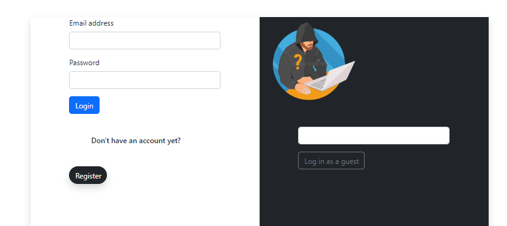
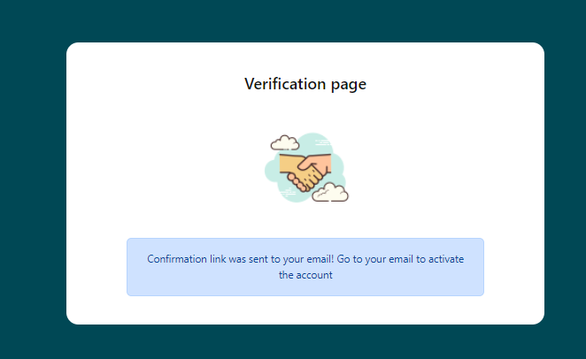
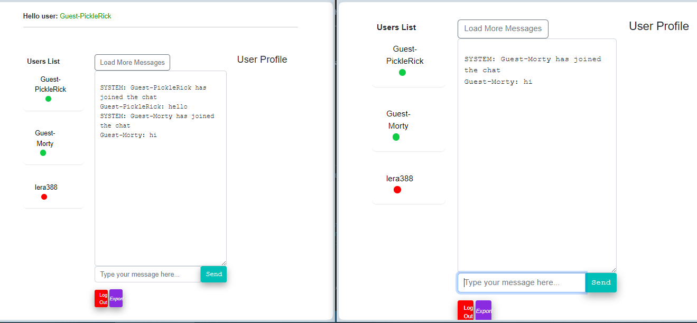

# Chat App Client Side

This repository contains the code for the client side of our Chat application.  
For the server-side code, see [Chat_App_Group_7](https://github.com/ValeriaK38/Chat_App_Group_7).

## How to run

To run the code, run the following commands:

```bash
npm install
npm start
```
## Screenshots

.
.
.
